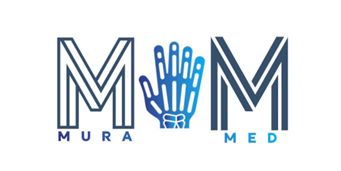

## MuraMed: A Revolution in Medical Diagnostics

### Project Overview

In the rapidly advancing field of healthcare AI, MuraMed stands as a pioneer in medical diagnostics. We leverage cutting-edge machine learning models to transform the landscape of medical diagnostics, particularly in musculoskeletal radiography. Our project revolves around the creation of MuraMed, an innovative healthcare technology company with a singular mission: to elevate medical diagnostics using artificial intelligence. We focus on addressing the critical need for precise and efficient diagnosis, with a specific emphasis on radiographs, including X-ray images. This initiative holds significant promise across various domains, including medical imaging, medical data analysis, diagnostics, and healthcare delivery. In this report, we present a comprehensive methodology for automating the classification of normal and abnormal X-ray images, with a specific focus on anatomical parts of the hand. We achieve this by employing Convolutional Neural Networks (CNN) in conjunction with the advanced VGG model. The effectiveness of our approach is thoroughly evaluated using the MURA dataset, which comprises musculoskeletal radiographs established by Stanford University. Our assessment covers method proficiency and the presentation of results.

---

### About us

**MuraMed** is an innovative healthcare technology company that aims to revolutionize medical diagnostics with a focus on radiographs (X-Ray images). In the intricate landscape of today's healthcare, the company addresses the vital need for accurate, efficient, and swift diagnosis. MuraMed's specialization lies in detecting bone abnormalities, and it offers an AI-powered diagnostic system tailored for healthcare professionals. This initiative is particularly significant for radiology, a field often challenged by the timeliness and precision of X-ray image interpretation. A brief description of our **MuraMed's Business Case** follows below.

In the domain of medical diagnostics, particularly in the field of **bone abnormality detection**, MuraMed has established a unique presence for itself. Using advanced AI technologies, MuraMed has developed a diagnostic system that is highly effective. This system doesn't just represent a technological advancement; it signifies a shift in how musculoskeletal conditions are diagnosed, making it faster and more accurate. This initiative has the potential to improve patient outcomes and overall well-being significantly for those with musculoskeletal disorders.

However, **MuraMed**'s expertise extends beyond bone abnormality detection; it also encompasses a broader revolution in **radiology**. The company is at the forefront of integrating Artificial Intelligence into this critical medical field, offering solutions that address the challenges faced by healthcare providers. The AI-driven approach adopted by MuraMed reduces the inefficiencies and human errors associated with traditional diagnostic methods. By providing radiologists and orthopedic doctors with user-friendly AI tools, MuraMed ensures that healthcare providers can make quick, well-informed decisions, ultimately enhancing patient care.

The **versatility** of MuraMed's technological platform is another key feature. The application is designed not only to meet the needs of experienced medical professionals but also to extend its benefits to a wider audience, including athletes, teachers, and physiotherapists. These individuals can use this platform for early detection and intervention of musculoskeletal issues. This inclusive approach democratizes diagnostic capabilities, making proactive healthcare more accessible. Through this multifaceted approach, **MuraMed** is set to make a lasting impact across various sectors, from specialized medicine to community healthcare and beyond.


<br>
<div style="text-align: center;">
  <figure>
    
    <br>
    <figcaption>MuraMed: A Revolution in Medical Diagnostics</figcaption>
  </figure>
</div>
<br>

When it comes to **MuraMed**'s long-term goals, the company's **Mission and Vision** serve as guiding principles. The company is not solely focused on providing AI-powered diagnostic solutions; it has a broader vision of impacting global healthcare. Specifically, MuraMed aims to ensure that quality healthcare is available to areas facing a severe shortage of skilled radiologists. This vision is not restricted to large healthcare facilities but extends to smaller clinics and even beyond the boundaries of the traditional healthcare industry. By integrating advanced AI algorithms with a specialized focus on bone abnormalities and a versatile application range, MuraMed aims to revolutionize medical diagnostics in an unprecedented manner. Through these initiatives, the company is set to bring about monumental changes that will redefine the landscape of healthcare, making quality diagnostic services accessible and affordable to all.

Similarly, the inherent **Value of MuraMed's Research** cannot be overstated. The company's research initiatives are designed to make substantial contributions across multiple domains, including healthcare, technology, business, and innovation. This multi-disciplinary approach not only highlights the company's commitment to improving patient care but also signals its intent to push the boundaries of existing technology. **MuraMed** is invested in creating a harmonious blend of technology and healthcare, using AI as a tool to bridge gaps and address inefficiencies in the current medical systems. Consequently, the company's research serves as a catalyst for business growth, as it opens up new opportunities for expansion and partnerships. 

In summary, both the mission and the research values of **MuraMed** underscore its commitment to being more than just a healthcare technology company. It strives to be a change-maker in the industry, leveraging technology to address crucial gaps in healthcare accessibility and quality. By doing so, MuraMed aims to foster not just business growth but also societal advancement, setting new standards in healthcare, technology, and innovation.

#### Business Strategy

From a business perspective, MuraMed strategically caters to various sectors, including healthcare, education, and the workplace. Our objectives encompass diagnostic support, telemedicine capabilities, workplace injury prevention, and athlete health monitoring. What sets us apart is our commitment to simplicity, model accuracy, and dedicated customer support. We distinguish ourselves from more complex competitors through our adherence to the Blue Ocean Strategy, an approach that prioritizes innovation and differentiation. This strategy guides us toward untapped opportunities in healthcare AI, and we actively seek proactive partnerships and adopt emerging technologies to maintain a leading position in the dynamic healthcare AI landscape.

#### Technical Implementations

The technical dimension of this report delves into data architecture, algorithm development, and quality assurance, offering a roadmap for effective model deployment. Our commitment to refining model performance is evident in techniques such as data augmentation, metric selection, and the use of training callbacks. Within this technical landscape, we employ three machine learning models: Simple CNN, Advanced CNN, and VGG-19, each with distinct performance characteristics.

- **Simple CNN:** Serving as our foundational baseline, it exhibits a test loss of 0.67427 and an accuracy of 0.61026, signaling the need for further refinement or exploration of more advanced models for medical applications.

- **Advanced CNN:** This model demonstrates superior performance with a lower test loss of 0.59758, an accuracy of 0.66938, and a commendable Cohen's Kappa score of 0.73658, establishing its reliability for medical imaging tasks.

- **VGG-19:** Our top-performing model achieves an accuracy of 0.80200 and a Cohen's Kappa score of 0.86291, despite a higher test loss of 0.91401, solidifying its position as the most effective among the three.

### Conclusion

In summary, this report underscores MuraMed's commitment to revolutionize medical diagnostics through AI-driven solutions. We prioritize clinical excellence, technological progress, and dedicated research and innovation. MuraMed's comprehensive approach positions us as a driving force in the healthcare AI landscape, ushering in positive change and elevating the standards of medical diagnostics.

For further insights into **MuraMed**'s groundbreaking work, one can refer to the comprehensive document: *[MuraMed_Documentation.pdf](./MuraMed_Documentation.pdf)*.


---

### Technical Installation - Python Environment Specifications

#### Libraries and Versions

The main libraries utilized are the following:

- **Pandas**: Version 2.1.0
- **NumPy**: Version 1.24.3
- **Matplotlib**: Version 3.7.2
- **Seaborn**: Version 0.12.2
- **Scikit-learn**: Version 1.3.0
- **TensorFlow**: Version 2.13.0-rc0

#### Detailed Specifications

- **Pandas**: The environment utilizes Pandas version **2.1.0**, which provides robust capabilities for data manipulation and analysis.
  
- **NumPy**: The version in use is **1.24.3**, essential for a variety of numerical operations. It complements Pandas in data transformation and manipulation.

- **Matplotlib**: The current version is **3.7.2**, offering a wide array of functionalities for data visualization.

- **Seaborn**: Version **0.12.2** is installed, extending Matplotlib's functionalities for more advanced data visualizations.

- **Scikit-learn**: The environment leverages Scikit-learn version **1.3.0**, a comprehensive library for machine learning tasks such as data splitting, model training, and evaluation.

- **TensorFlow**: Version **2.13.0-rc0** forms the backbone for all deep learning tasks, offering a comprehensive and flexible platform for building, training, and deploying machine learning models.

#### Important Notes

##### Important Note 1 - UserWarning

You may receive a UserWarning that indicates that TensorFlow Addons (TFA) has stopped development of new features and is in maintenance mode until May 2024. This means it's advisable to transition to other TensorFlow community libraries for new features or functions that were previously covered by TFA.

For more information see: [GitHub Issue](https://github.com/tensorflow/addons/issues/2807)

##### Important Note 2 - TensorFlow and Installation

The installation of TensorFlow can sometimes be tricky. To install TensorFlow through `pip`, the following commands should be run:

```bash
pip install tensorflow
```

To additionally install TensorFlow Addons:

```bash
pip install tensorflow-addons
```

The current analysis will be done on [Jupyter Notebook](http://jupyter.org/) and in [Python 3.10](https://www.python.org/downloads/release/python-3100/).

---


### Deliverables
1. [Figures](#figures)
2. [Documentation](#documentation)
3. [README](#readme)
4. [Datasets](#datasets)
5. [Jupyter Notebooks](#jupyter-notebooks)
6. [Requirements](#requirements)
7. [Model Weights](#model-weights)

### Figures
This folder contains Figures generated from Jupyter Notebooks.


### Documentation
MuraMed Documentation.pdf files are available for an in-depth understanding of the project.

### README
The README.md file offers an overview and provides navigation guidance for this repository.

### Datasets
The dataset.txt file contains the dataset details used for training and validation of the models.

### Jupyter Notebooks
This repository contains three types of Jupyter Notebooks:
- muramed_advanced_cnn.ipynb: Outlines the architecture and training procedures for the advanced CNN model.
- muramed_simple_cnn.ipynb: Provides the implementation details for the intial baseline simple CNN model.
- muramed_vgg.ipynb: Focuses on the VGG19 model and its specifics for medical image classification.

### Requirements
The requirements.txt file lists all the dependencies needed to run the code in this repository.

### Model Weights
The weights.txt file provides links to access files containing weights for the best epochs of our models.


---
### Contributors

- [x] [Dimitra Diamanti](https://github.com/ddiamanti)
- [x] [Dimitris Matsanganis](https://github.com/dmatsanganis)
- [x] [Foteini Nefeli Nouskali](https://github.com/FoteiniNefeli)
- [x] [Eva Ruci](https://github.com/EvaRoutsi)


[](https://tensorflow.org)


